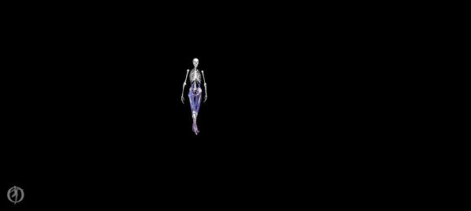

3dpredictsim (3d predictive simulations of walking)
===================================================

This repository contains code and data to generate three-dimensional muscle-driven predictive simulations of human gait as described in: [Falisse A, Serrancoli G, Dembia C, Gillis J, Jonkers J, De Groote F. 2019 Rapid predictive simulations with complex musculoskeletal models suggest that diverse healthy and pathological human gaits can emerge from similar control strategies. Journal of the Royal Society Interface 16: 20190402](http://dx.doi.org/10.1098/rsif.2019.0402).

Here is an example of a predictive simulation of walking, based on a complex musculoskeletal model (29 degrees of freedom, 92 muscles, and 6 contact spheres per foot), generated with our framework (convergence in ~40 minutes):

The best way to get started is to run OCP/PredSim_all_v2.m and to explore the code from there (make sure you install CasADi beforehand: [see CasADi website](https://web.casadi.org/)).

The code has been updated since the release of the paper (bug fixes, added functionalities, etc.). Please have a look at the CHANGELOG. You can find the code used to generate the results of the paper on the [branch paper](https://github.com/antoinefalisse/3dpredictsim/tree/paper). You might get different results when trying to reproduce the results of the paper from the master branch (e.g., we found and corrected a bug in one of the metabolic energy models and adjusted the collocation scheme).

Thanks for citing our work in any derived publication. Feel free to reach us for any questions: afalisse@stanford.edu | antoinefalisse@gmail.com | friedl.degroote@kuleuven.be. This code has been developed on Windows using MATLAB2017b. There is no guarantee that it runs smooth on other platforms. Please let us know if you run into troubles.
